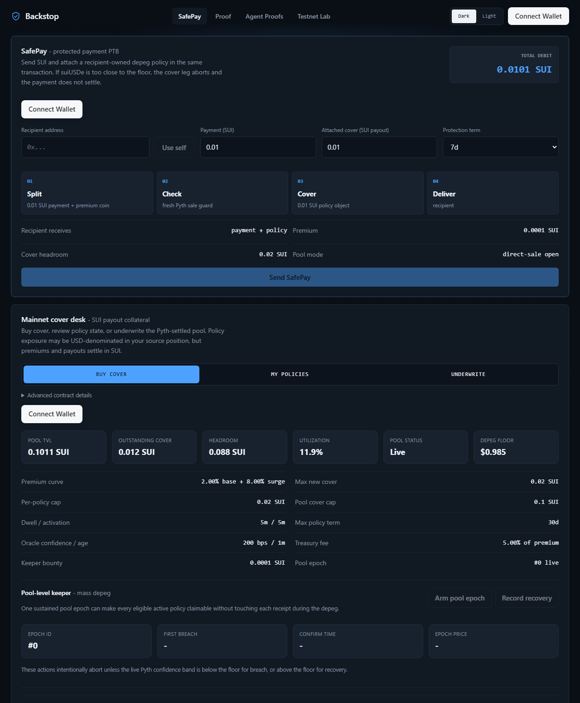
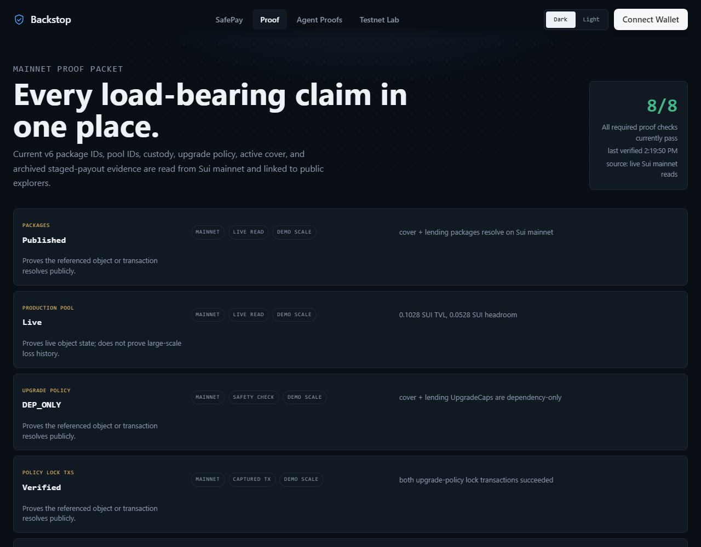

# Backstop

**On-chain depeg & crash insurance — and protected payments — on Sui.**
Buy cover against an asset losing its value; if it breaks, your policy pays out
automatically, settled by the Pyth oracle with no claims committee. Or use
**SafePay** to send a payment that attaches recipient-owned cover in the same
atomic transaction.

- **Website (homepage):** https://backstop.gudman.xyz
- **Repo:** https://github.com/Ridwannurudeen/backstop
- **Network:** Sui **mainnet** (live), plus testnet research surfaces
- **Proof:** https://backstop.gudman.xyz/proof — live IDs + verifiable transactions



## Why it matters

Sui has no native way to transfer risk. When something breaks, the only backstop
is human emergency action — a $223M Sui exploit was "fixed" by validators voting
to roll back the chain. Less than 2% of DeFi is insured, and nothing lets a
person, treasury, or protocol **programmatically** protect against an asset
losing value. Backstop replaces governance-by-emergency with a market primitive:
objective, automatic, oracle-settled protection that any wallet or app can use or
build on. It makes money on Sui move **safely**, not just quickly.

## What it does

- **Depeg cover** — protect a stablecoin (suiUSDe) against falling below $0.985.
  If it depegs, the policy pays out in SUI, automatically.
- **SafePay** — a payment that, in one atomic PTB, buys cover and delivers the
  payment **plus** the policy to the recipient. Because it's atomic, if the asset
  is too close to depegging the cover aborts and the payment doesn't settle — a
  genuinely risk-aware payment. *Proven on mainnet:* tx `Hc5Yg83…RgbpN`.
- **Stress test** — on `/depeg`, drag a slider to crash the price and watch a
  policy walk its real settlement path (arm → dwell → pay out), then recover
  above the floor to see a wick correctly pay nothing.

### Not just stablecoins
The contract is asset-agnostic: `DepegCoverPool<T>` is generic over the coin, and
the insured Pyth feed, exponent, and floor are pool parameters — nothing is
hardcoded to a stablecoin. The primitive is "pay out if a Pyth-priced asset falls
at or below a chosen floor." For a $1 stablecoin that's depeg cover (live today);
for BTC/ETH/SUI it's crash/downside cover with the floor set below spot. Covering
a new asset is a pool creation (`create_and_share`), not new code.

### Who backs the cover (funding)
Payouts come from **underwriters**, not from Backstop. Underwriters deposit
capital into the cover pool and receive shares; buyers' premiums (minus a small
fee) flow to them, so they earn yield when nothing breaks and absorb the loss on
a breach. The pool is always **fully collateralized** (`funds ≥ total_cover`) —
no leverage — and underwriters can't withdraw capital backing live policies.
*Honest state:* today's pool is intentionally small (~0.1 SUI) and was seeded by
the team to prove the loop end-to-end; the mechanism is open for third-party
underwriters, and onboarding real LPs after an audit is Phase 1 of the roadmap.

## How it works

- **Trustless settlement.** The contract reads the Pyth `PriceInfoObject`
  directly — freshness, a confidence band (worst-case edge must be below the
  floor), and a sustained breach are all required before it pays. A guardian can
  pause new sales but can **never** block a payout.
- **Anti-manipulation.** A **dwell** (sustained-breach window) and an
  **activation delay** stop wicks and last-tick adverse selection.
- **Full collateralization**, enforced in Move's type system on every buy and
  withdrawal.
- **Programmable transactions.** Buy and SafePay are each a single atomic PTB
  that bundles a fresh oracle update with the financial action — clean only on
  Sui, where assets (your policy) are owned objects.

## Live on mainnet

| Piece | Status |
|---|---|
| `pyth_cover_pool` (open direct-sale pool) | live — powers `/depeg` buy + SafePay |
| `pyth_cover_pool` v6 (production pool) | live — audit-hardened, adapter-only (`BuyerCap`), `DEP_ONLY` upgrade-locked, AdminCap in custody |
| SafePay protected-payment PTB | live + proven (`Hc5Yg83…`) |
| Full depeg lifecycle (insure → arm → confirm → claim) | proven on-chain |

Key package/pool IDs (abbreviated): open cover pkg `0x69505963…cad62`, open pool
`0x45712308…b3e2`, v6 production pool `0x1d9d15da…`. **Full IDs and transaction
digests are in `deployment.json` and on `/proof`.** Run `npm run verify:public`
to check them on-chain (50/50).



## App surfaces

- **SafePay / Cover** (`/depeg`) — protected payment + the mainnet cover desk
  (buy, underwrite, manage policies) + the interactive stress test.
- **Proof** (`/proof`) — live package/pool IDs, custody, upgrade locks, and
  verifiable transactions.
- **Agent Proofs** (`/agent/*`) — the AI underwriter's decisions + accountability
  (testnet/research).
- **Testnet Lab** (`/lab/*`) — legacy DeepBook Predict flows; lineage, not the
  main product.

## Honest status

- The interactive `/depeg` buy and SafePay use the **open direct-sale pool**
  (low-cap, experimental). The **v6 production pool** is adapter-only by design
  (cover is position-bound via a `BuyerCap` adapter, not naked wallet buys).
- The paid claim in `deployment.json` is **archived v3 staged mechanism-test**
  evidence (permissive trigger params) — it proves the buy → dwell → claim path
  pays on-chain; it is **not** a real depeg event or a v6 payout. The live v6
  pool holds active cover while suiUSDe stays above the floor.
- Testnet/research surfaces (DeepBook Predict reads, SRX, RiskFeed, agent
  accountability) are **not** a fully trustless production oracle; dispute
  resolution is admin-resolved today.
- Not yet live: stable/USD collateral accounting, an external protocol
  integration, and independent Move review. See `ROADMAP.md`.

## Run locally

```bash
cd app
npm install
npm run dev
```

Read-only surfaces work without a wallet; mainnet actions need a Sui wallet and
real SUI.

## Verify

```bash
npm run verify:public      # check live IDs + transactions on-chain (50/50)
npm run verify:readiness   # app typecheck/build, agent typecheck, SDK build, PTB devInspect, custody, public checks
```

## SDK & integration

```bash
npm install @gudman/backstop-sdk @mysten/sui
```

See `INTEGRATION.md` for SDK + PTB examples (including the SafePay shape),
`DEPLOYMENTS.md` for what's live vs archived, and `SECURITY.md` /
`THREAT_MODEL.md` for risk boundaries.

## Architecture

```text
app/        Vite + React + dapp-kit frontend
agent/      Node/tsx scripts: Pyth provisioning, SafePay/buy proofs, verification, custody
sdk/        TypeScript SDK
contracts/  pyth_cover_pool/    mainnet depeg/crash cover pool (+ SafePay PTB)
            pyth_lending_demo/  reference adapter consumer
            risk_index/ risk_feed/ accountability/   testnet research primitives
            cover_pool/         legacy testnet lane (not production-safe)
```

Canonical IDs and digests live in `deployment.json`.

## Roadmap (vision)

The risk layer for money on Sui — see `ROADMAP.md` for the full sequence:
**(1)** harden + one real integration → **(2)** any Pyth asset, not just
stablecoins → **(3)** SafePay as a payments rail (SDK/widget) → **(4)**
self-insuring money (yield-funded perpetual cover) → **(5)** an open risk
marketplace.

## License

MIT — see [`LICENSE`](LICENSE). © 2026 Ridwannurudeen.
